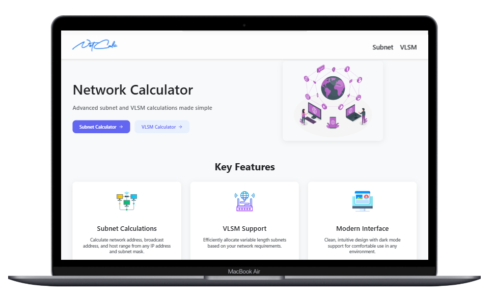
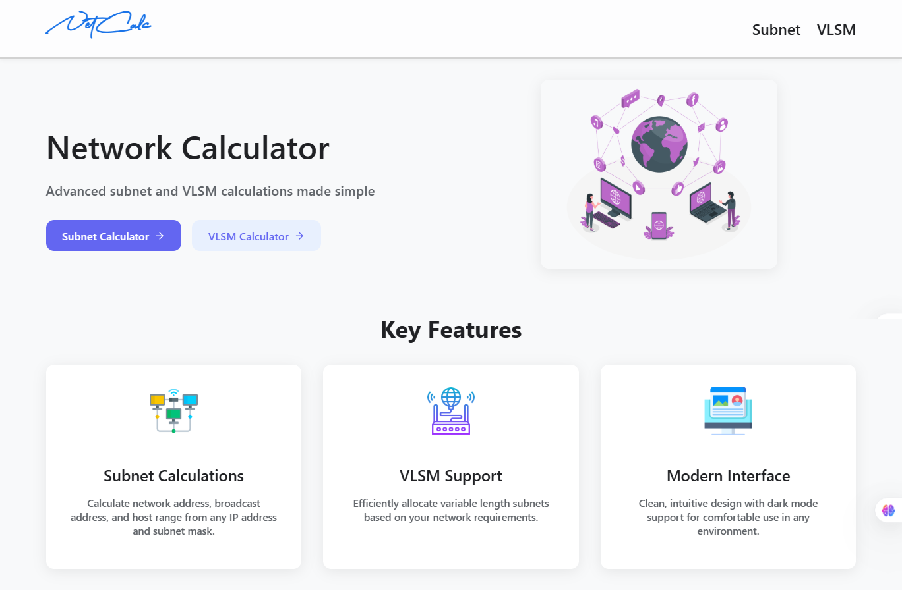
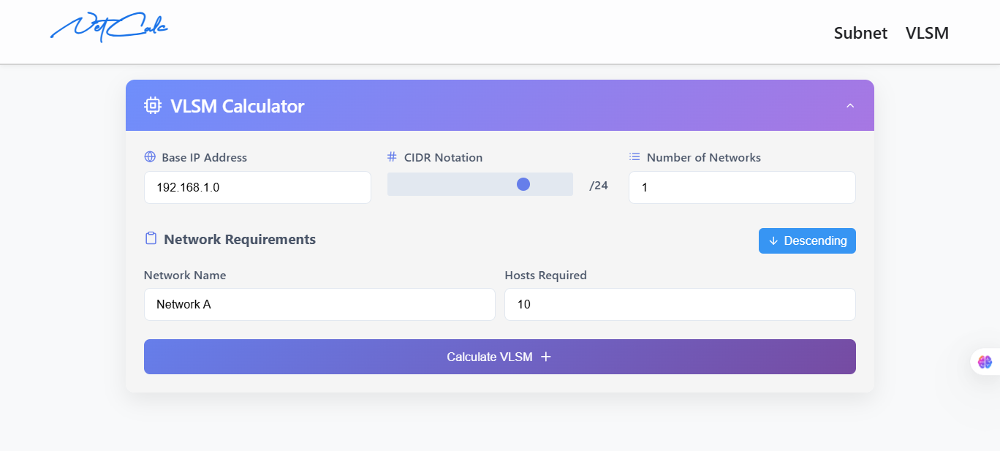
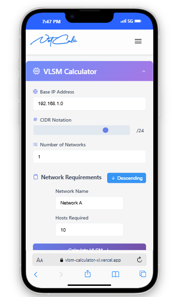
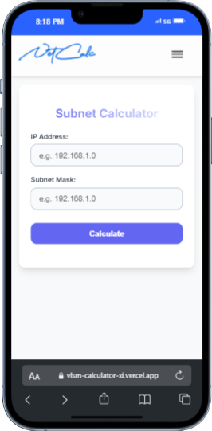

# VLSM Calculator
A professional tool for calculating Variable Length Subnet Masks (VLSM) for network engineers and students.

---



---

## Features

- Calculate subnet masks, network ranges, and CIDR notation
- Support for multiple network requirements in a single calculation
- Detailed results including network address, broadcast address, and usable host range
- Responsive design that works on desktop and mobile devices
- Progressive Web App (PWA) support for offline use

---



---

## Technologies Used

- React.js
- Framer Motion (for animations)
- CSS3 (flexbox and grid layout)
- IP calculation utilities

---



---

## Installation

1. Clone the repository:
   ```bash
   git clone https://github.com/AbdulAHAD968/VLSM-Calculator.git
   ```
2. Install dependencies:
   ```bash
   cd vlsm-calculator
   npm install
   Run the development server:
   npm start
   ```
3. Open http://localhost:3000 to view in browser.

4. Building for Production
   To create an optimized production build:
```bash
npm run build
```
This will create a build folder with all static files ready for deployment.

---

# Usage

1. Enter the base IP address and CIDR notation
2. Specify your network requirements (name and number of hosts needed)
3. Click "Calculate" to generate the VLSM results
4. View detailed subnet information for each network

---

# Project Structure
```bash
/src
  /components      # React components
  /utils           # Utility functions and calculators
  /styles          # CSS stylesheets
/public            # Static files and assets
```

---

# Contributing
- [x] Contributions are welcome. Please follow these guidelines:
- [ ] Fork the repository
- [ ] Create a new branch for your feature
- [ ] Submit a pull request with a clear description of changes

---

# License
This project is licensed under the MIT License - see the LICENSE file for details.

---

# Acknowledgments
- [x] Inspired by networking courses and certification materials
- [x] Built with modern web development best practices

# Mobile View

---



---



---
